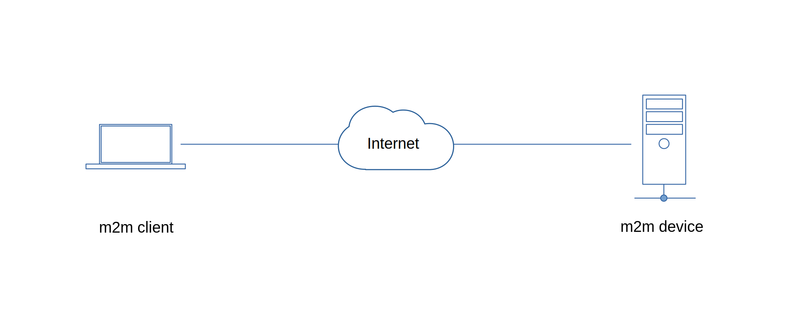
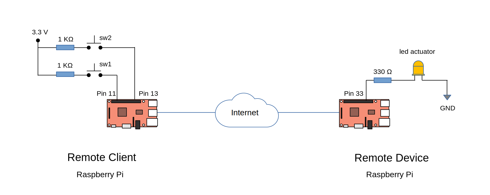

# Quick Tour
   1. [M2M Publish-Subscribe Pattern](#publish-subscribe-pattern)
   2. [M2M Client-Server Pattern](#client-server-pattern)
   3. [Edge Computing Using Local Area Networking](https://github.com/Node-M2M/m2m-edge-example)
   4. [M2M Browser Client](#using-a-browser-client)
   5. [Create an Edge Gateway](https://github.com/Node-M2M/edge-gateway)
   6. [Create an M2M Bridge Gateway](https://github.com/Node-M2M/m2m-bridge-gateway)
   7. [Raspberry Pi Remote Control](#raspberry-pi-remote-control)
   8. [M2M Client-Server Using HTTP Api](https://github.com/EdAlegrid/http-api)
   9. [Create a Server Load Balancer for Edge Computing](https://github.com/Node-M2M/edge-load-balancing)
   10. [Edge C/C++ Connector Application](https://github.com/Node-M2M/CppEdgeConnector)
   11. [Edge C# Connector Application](https://github.com/Node-M2M/CsharpEdgeConnector)
   <!--7. [Monitor Data from Remote C/C++ Application through IPC (inter-process communication)](https://github.com/EdAlegrid/cpp-ipc-application-demo)
   8. [Web application demo using the fetch api](https://github.com/EdAlegrid/m2m-web-application-demo)
   9. [Web application demo using only an m2m browser client](https://github.com/EdAlegrid/m2m-browser-client-demo)
   10. [Monitor Data from Remote C# Application through IPC (inter-process communication)](https://github.com/EdAlegrid/csharp-ipc-application-demo)
   11. [File Integrity Monitoring](https://github.com/EdAlegrid/file-integrity-monitoring)
   12. [Create A Simple Gateway Load Balancer](https://github.com/EdAlegrid/gateway-load-balancer)-->

<br>

<!--- [API Reference](https://github.com/Node-M2M/M2M-API) --->

---

<br>

## Publish-Subscribe Pattern

[](https://raw.githubusercontent.com/EdoLabs/src2/master/quicktour.svg?sanitize=true)


Before you start, ensure you have a [node.js](https://nodejs.org/en/) installation on your client and device computers. [Create an account](https://www.node-m2m.com/m2m/account/create) and register your remote device.

### Device Setup

#### 1. Create a device project directory and install *m2m*.

```js
$ npm install m2m
```

#### 2. Save the code below as *device.js* in your device project directory.

```js
const m2m = require('m2m');

// The deviceId 100 must be registered with node-m2m
let device = new m2m.Device(100);

device.connect(() => {
  device.publish('random-number', (ws) => {
    let rn = Math.floor(Math.random() * 100);
    ws.send(rn);
  });
});
```
async/await
```js
const m2m = require('m2m');

// The deviceId 100 must be registered with node-m2m
let device = new m2m.Device(100);

async function app(){
  await device.connect();

  device.publish('random-number', (ws) => {
    let rn = Math.floor(Math.random() * 100);
    ws.send(rn);
  });
}
app();
```

#### 3. Start your device application.

```js
$ node device.js
```

The first time you run your application, it will ask for your full credentials.
```js
? Enter your userid (email):
? Enter your password:
? Enter your security code:

```
The next time you run your application, it will start automatically using a saved user token.

However, after a grace period of 15 minutes, you may need to provide your *security code* to restart your application.

At anytime, if you're having difficulty or issues restarting your application, you can re-authenticate with an `-r` flag. This will refresh your token as shown below.
```js
$ node device.js -r
```


### Client Setup

#### 1. Create a client project directory and install *m2m*.

```js
$ npm install m2m
```

#### 2. Save the code below as *client.js* in your client project directory.

**Method 1**

Creating a device object alias from .accessDevice() method.

```js
const m2m = require('m2m');

let client = new m2m.Client();

client.connect(() => {
  // access the remote device using an alias object
  let device = client.accessDevice(100);

  device.subscribe('random-number', (data) => {
    console.log('subscribe random-number', data); // 81, 68, 115 ...
  });
});
```

**Method 2**

Access the remote device directly from the client object. 

```js
const m2m = require('m2m');

let client = new m2m.Client();

async function app(){
  await client.connect();

  client.subsribe({id:100, topic:'random-number'}, (data) => {
    console.log('subsribe random-number', data); // 81, 68, 115 ...
  });
}
app();
```

#### 3. Start your application.
```js
$ node client.js
```
You should get a similar output result as shown below.
```js
subscribe random-number 76
subscribe random-number 34
...

```

<br>


## Client-Server Pattern

[](https://raw.githubusercontent.com/EdoLabs/src2/master/quicktour.svg?sanitize=true)

### Device Setup

#### 1. Create a device project directory and install *m2m*.

```js
$ npm install m2m
```

#### 2. Save the code below as *device.js* in your device project directory.

```js
const m2m = require('m2m');

let testData = 'node-m2m';

let device = new m2m.Device(100);

device.connect(() => {
  device.dataSource('test-data', (ws) => {
    if(ws.payload){
      testData =  ws.payload;
    }
    ws.send(testData);
  });
});
```
async/await
```js
const m2m = require('m2m');

let testData = 'node-m2m';

let device = new m2m.Device(100);

async function app(){
  await device.connect();

  device.dataSource('test-data', (ws) => {
    if(ws.payload){
      testData =  ws.payload;
    }
    ws.send(testData);
  });
}
app();
```

#### 3. Start your device application.

```js
$ node device.js
```

### Client Setup

#### 1. Create a client project directory and install *m2m*.

```js
$ npm install m2m
```

#### 2. Save the code below as *client.js* in your client project directory.

**Method 1**

Create an *alias* object using the client's *accessDevice* method as shown in the code below.

```js
const m2m = require('m2m');

let client = new m2m.Client();

client.connect(app);

function app(){
  // access the remote device using an alias object
  let device = client.accessDevice(100);

  // read the current data from 'test-data' topic
  device.read('test-data', (data) => {
    console.log('read test-data', data); // node-m2m
  });

  // update 'test-data' topic using the payload 'node-m2m is awesome'
  device.write('test-data', 'node-m2m is awesome', (data) => {
    console.log('write test-data', data);
  });

  // read the updated 'test-data' topic
  device.read('test-data', (data) => {
    console.log('read test-data', data); // node-m2m is awesome
  });
}
```
async/await api
```js
const m2m = require('m2m');

let client = new m2m.Client();

async function app(){
  await client.connect();

  let device = client.accessDevice(100);

  let rd1 = await device.read('test-data'); 
  console.log('read test-data', rd1); // node-m2m

  let wd = await device.write('test-data', 'node-m2m is awesome');
  console.log('write test-data', wd);

  let rd2 = await device.read('test-data');
  console.log('read test-data', rd2); // node-m2m is awesome
}
app();

```


**Method 2**

Instead of creating an alias, just provide the *device id* through the various available methods from the client object.

```js
const m2m = require('m2m');

let client = new m2m.Client();

client.connect(app);

function app(){
  client.read({id:100, topic:'test-data'}, (data) => {
    console.log('read test-data', data); // node-m2m
  });

  client.write({id:100, topic:'test-data', payload:'node-m2m is awesome'}, (data) => {
    console.log('write test-data', data);
  });

  client.read({id:100, topic:'test-data'}, (data) => {
    console.log('read test-data', data); // node-m2m is awesome
  });
}
```
async/await api
```js
const m2m = require('m2m');

let client = new m2m.Client();

async function app(){

  await client.connect(app);

  let rd1 = await client.read({id:100, topic:'test-data'}); 
  console.log('read test-data', rd1); // node-m2m

  let wd = await client.write({id:100, topic:'test-data', payload:'node-m2m is awesome'});
  console.log('write test-data', wd);

  let rd2 = await client.read({id:100, topic:'test-data'});
  console.log('read test-data', rd2); // node-m2m is awesome
}
app();
```

#### 3. Start your application.
```js
$ node client.js
```
Similar with remote device setup, you will be prompted to enter your credentials.

You should get a similar output result as shown below.
```js
read test-data node-m2m
write test-data node-m2m is awesome
read test-data node-m2m is awesome
```

<br>

## Using A Browser Client
<br>

Using the same remote device from the client-server quicktour, we will use a browser client to access its available resources.
## Browser Client Setup

#### 1. Login to [node-m2m](https://www.node-m2m.com/m2m/account/login) to create an access token. 

From the *manage security* section in the main menu under the *user account* tab, generate a web access token.

#### 2. Install *m2m* in your http server.

Copy the minimized file `node-m2m.min.js` from `node_modules/m2m/dist` directory into your server's public javascript directory.

Include `node-m2m.min.js` on your HTML file `<script src="YOUR_SCRIPT_PATH/node-m2m.min.js"></script>`.

This will create a global **NodeM2M** object.

#### 3. Create a client object instance from the global NodeM2M object.

Access the resources from the remote device directly from the client instance as shown below.

```js
<script> 

// Protect your access token at all times  
var tkn = 'fce454138116159a6ad9a4234e71de810a1087fa9e7fbfda74503d9f52616fc5';
 
var client = new NodeM2M.Client(); 

client.connect(tkn, app);

function app(){
  client.subsribe({id:100, topic:'random-number'}, (data) => {
    console.log('subsribe random-number', data); // 81, 68, 115 ...
  });

  client.read({id:100, topic:'test-data'}, (data) => {
    console.log('read test-data', data); // node-m2m
  });

  client.write({id:100, topic:'test-data', payload:'node-m2m is awesome'}, (data) => {
    console.log('write test-data', data);
  });

  client.read({id:100, topic:'test-data'}, (data) => {
    console.log('read test-data', data); // node-m2m is awesome
  });
}

</script>
```

Using your browser dev tools, you should get a similar result as shown below. 
```js
read test-data node-m2m
write test-data node-m2m is awesome
read test-data node-m2m is awesome
subsribe random-number 93

```
<br>

Check the [m2m browser client web application quick tour](https://github.com/EdAlegrid/m2m-browser-client-demo) for a complete web application using a browser client.

<br>

## Raspberry Pi Remote Control

[](https://raw.githubusercontent.com/EdoLabs/src2/master/quicktour2.svg?sanitize=true)

In this quick tour, we will install two push-button switches ( GPIO pin 11 and 13 ) on the remote client, and an led actuator ( GPIO pin 33 ) on the remote device.

The client will attempt to turn *on* and *off* the remote device's actuator and receive a confirmation response of *true* to signify the actuator was indeed turned **on** and *false* when the actuator is turned **off**.

The client will also show an on/off response times providing some insight on the responsiveness of the remote control system.     

### Remote Device Setup

#### 1. Create a device project directory and install *m2m* and *array-gpio*.
```js
$ npm install m2m array-gpio
```
#### 2. Save the code below as *device.js* in your device project directory.

```js
const { Device } = require('m2m');

let device = new Device(200);

device.connect(() => {
  device.setGpio({mode:'output', pin:33});
});
```

#### 3. Start your device application.
```js
$ node device.js
```

### Remote Client Setup

#### 1. Create a client project directory and install *m2m* and *array-gpio*.
```js
$ npm install m2m array-gpio
```
#### 2. Save the code below as *client.js* in your client project directory.

```js
const { Client } = require('m2m');
const { setInput } = require('array-gpio');

let sw1 = setInput(11); // as ON switch
let sw2 = setInput(13); // as OFF switch

// enable pull-down resistor
sw1.setR(0);
sw2.setR(0);

let client = new Client();

client.connect(app);

function app(){
  let t1 = null;
  let device = client.accessDevice(200);

  sw1.watch(1, (state) => {
    if(state){
      t1 = new Date();
      console.log('turning ON remote actuator');
      device.output(33).on((data) => {
        let t2 = new Date();
        console.log('ON confirmation', data, 'response time', t2 - t1, 'ms');
      });
    }
  });

  sw2.watch(1, (state) => {
    if(state){
      t1 = new Date();
      console.log('turning OFF remote actuator');
      device.output(33).off((data) => {
        let t2 = new Date();
        console.log('OFF confirmation', data, 'response time', t2 - t1, 'ms');
      });
    }
  });
}
```
#### 3. Start your application.
```js
$ node client.js
```
The led actuator from remote device should toggle *on* and *off* as you press the corresponding ON/OFF switches from the client.

