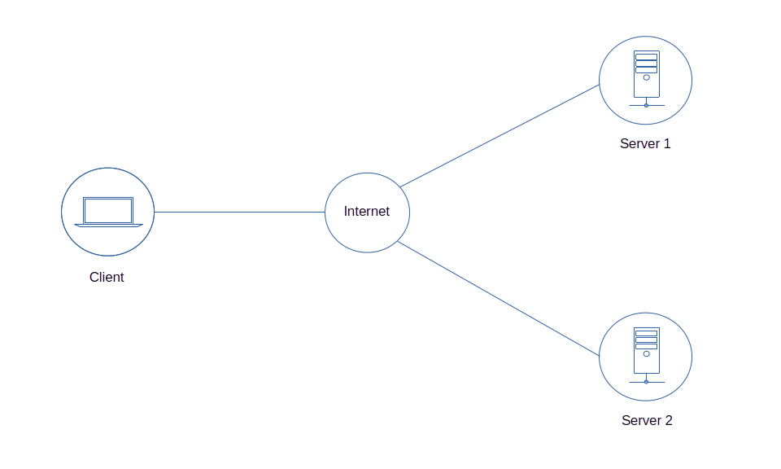

# Quick Tour
   1. [M2M Publish-Subscribe Pattern](#m2m-publish-subscribe-pattern)
   2. [M2M Client-Server Pattern](#m2m-client-server-pattern)
   3. [M2M Browser Client](#m2m-browser-client)
   4. [Edge Computing Using Local Area Networking](https://github.com/Node-M2M/m2m-edge-example)
   5. [Create an Edge Gateway](https://github.com/Node-M2M/edge-gateway)
   6. [Create an M2M Bridge Gateway](https://github.com/Node-M2M/m2m-bridge-gateway)
   7. [Create a Load Balancer Server for Edge Computing](https://github.com/Node-M2M/edge-load-balancing)
   8. [M2M Server-To-Server Communication](https://github.com/Node-M2M/m2m-server-to-server-communication)
   9. [Edge Raspberry Pi GPIO Access](https://github.com/Node-M2M/edge-rpi-gpio-access)
   <!--8. [Edge C/C++ Connector Application](https://github.com/Node-M2M/CppEdgeConnector)
   9. [Edge C# Connector Application](https://github.com/Node-M2M/CsharpEdgeConnector)-->
      
   <!--7. [Monitor Data from Remote C/C++ Application through IPC (inter-process communication)](https://github.com/EdAlegrid/cpp-ipc-application-demo)
   7. [M2M Client-Server Using HTTP Api](https://github.com/EdAlegrid/http-api)
   8. [Web application demo using the fetch api](https://github.com/EdAlegrid/m2m-web-application-demo)
   9. [Web application demo using only an m2m browser client](https://github.com/EdAlegrid/m2m-browser-client-demo)
   10. [Monitor Data from Remote C# Application through IPC (inter-process communication)](https://github.com/EdAlegrid/csharp-ipc-application-demo)
   11. [File Integrity Monitoring](https://github.com/EdAlegrid/file-integrity-monitoring)
   12. [Create A Simple Gateway Load Balancer](https://github.com/EdAlegrid/gateway-load-balancer)-->

<br>

<!--- [API Reference](https://github.com/Node-M2M/M2M-API) --->

---

<br>

## M2M Publish-Subscribe Pattern

[](https://raw.githubusercontent.com/EdoLabs/src2/master/quicktour.svg?sanitize=true)


Before you start, &nbsp;ensure you have a [node.js](https://nodejs.org/en/) installation in all of your remote endpoints.

[Create an account](https://www.node-m2m.com/m2m/account/create) and register your server endpoints.

### Server 1 Setup

#### Create server 1 project directory and install *m2m* on your endpoints.

```js
$ npm install m2m
```
#### 1. Choose any connect api below and save the code as *server.js* in your server 1 project directory.

Connect using callback
```js
const m2m = require('m2m');

let server = new m2m.Server(100);

server.connect(() => {
  // server resources 
  server.publish('random-number', (ws) => {
    let rn = Math.floor(Math.random() * 100);
    let data = {id:ws.id, topic:ws.topic, value:rn};
    ws.send(data);
  });
});
```
Connect using async/await

```js
const m2m = require('m2m');

let server = new m2m.Server(100);

let main = async () => {
  await server.connect();
  // add server resources here
}

main();
```
Connect using promise

```js
const m2m = require('m2m');

let server = new m2m.Server(100);

m2m.connect()
.catch(console.log)
.then(console.log) // success
.then(() => {
  // add server resources here
})  
```
#### 2. Start server 1 application.

```js
$ node server.js
```

The first time you run your application, &nbsp;it will ask for your userid and password credentials.
```js
? Enter your userid (email):
? Enter your password:

```
The next time you run your application, &nbsp;it will start automatically using a saved user token.

At anytime, &nbsp;if you're having difficulty or issues restarting your application, &nbsp;you can re-authenticate with an `-r` flag. This will refresh your token as shown below.
```js
$ node server.js -r
```
### Server 2 Setup
#### Create server 2 project directory and install *m2m* on your endpoints.
```js
$ npm install m2m
```
#### 1. Save the code below as *server.js* in your server 2 project directory.

```js
const m2m = require('m2m');

let server = new m2m.Server(200);

let main = async () => {
  let result = await server.connect();
  console.log(result); // success

  server.pub('random-number', (ws) => {
    let rn = Math.floor(Math.random() * 100);
    ws.send({id:ws.id, topic:ws.topic, value:rn});
  });
}

main();
```

#### 2. Start server 2 application.

```js
$ node server.js
```

### Client Setup

#### 1. Save the code below as *client.js* in your client project directory.

**Method 1:** &nbsp; Access each server using the access method
```js
const m2m = require('m2m');

let client = new m2m.Client();

client.connect()
.catch(console.log)
.then(console.log) // success
.then(() => {
  let client1 = client.access(100);
  let client2 = client.access(200);

  // using the default 5 secs polling interval
  client1.subscribe('random-number', (data) => {
    console.log('client1 subscribe random-number', data);
  });
  
  // using a polling interval of 10 secs 
  client2.sub('random-number', 10000, (data) => {
    console.log('client2 subscribe random-number', data);
  });

  setTimeout(() => {
    client1.unsubscribe('random-number');
    console.log('client1 unsub');
  }, 30000);

  setTimeout(async () => {
    // confirm unsubscribe if successful
    let result = await client2.unsub('random-number');
    console.log('client2 unsub', result); // true if successful
  }, 60000);
})
```

**Method 2:** &nbsp; Access each server directly from the client object by providing the server id  
```js
const { Client } = require('m2m');

let client = new Client();

client.connect()
.catch(console.log)
.then(console.log) // success
.then(() => {

  // using the default 5 secs polling interval
  client.subscribe(100, 'random-number', (data) => {
  // or
  //client.subscribe({id:100, topic:'random-number'}, (data) => {
    console.log('client1 subscribe random-number', data);
  });
  
  // using a polling interval of 10 secs 
  client.sub(200, 'random-number', 10000, (data) => {
  // or
  //client.sub({id:200, topic:'random-number', interval:10000}, (data) => {
    console.log('client2 subscribe random-number', data);
  });

  setTimeout(() => {
    client.unsubscribe(100, 'random-number');
    console.log('client1 unsub');
  }, 30000);

  setTimeout(async () => {
    // confirm unsubscribe if successful
    let result = await client.unsub({id:200, topic:'random-number'});
    console.log('client2 unsub', result); // true if successful
  }, 60000);
})
```

#### 3. Start client application.
```js
$ node client.js
```
You should get a similar output result as shown below.
```js
client1 subscribe random-number { id: 100, topic: 'random-number', value: 18 }
client1 subscribe random-number { id: 100, topic: 'random-number', value: 8 }
client2 subscribe random-number { id: 200, topic: 'random-number', value: 98 }
client1 subscribe random-number { id: 100, topic: 'random-number', value: 96 }
client1 unsub
client2 subscribe random-number { id: 200, topic: 'random-number', value: 34 }
client1 subscribe random-number { id: 100, topic: 'random-number', value: 15 }
client2 unsub true
```

<br>


## M2M Client-Server Pattern

[](https://raw.githubusercontent.com/EdoLabs/src2/master/quicktour.svg?sanitize=true)

### Server 1 Setup

#### 1. Save the code below as *server.js* in your server 1 project directory.

```js
const { Server } = require('m2m');

let server = new Server(100);

server.connect(() => {

  // publish resource
  server.publish('random-number', (ws) => {
    let rn = Math.floor(Math.random() * 100);
    ws.send({id:ws.id, topic:ws.topic, value:rn});
  });

  // common read/write resource 
  server.dataSource('/machine-1', (ws) => {
    let data = { id:ws.id, rootTopic:ws.rootTopic, subTopic:ws.subTopic }

    if(ws.topic === '/machine-1/sensor-1'){
      data.type = 'sensor-1';
      data.value = Math.floor(Math.random() * 200);
    }
    else if(ws.topic === '/machine-1/sensor-2'){
      data.type = 'sensor-2';
      data.value = Math.floor(Math.random() * 400);
    }
    else if(ws.topic === '/machine-1' && ws.payload){
      data.type = ws.payload.type;
      data.value = ws.payload.value;
    }  
    ws.send(data);
  });
});
```

#### 2. Start server 1 application.

```js
$ node server.js
```

### Server 2 Setup

#### 1. Save the code below as *server.js* in your server 2 project directory.

```js
const { Server } = require('m2m');

let server = new Server(200);

server.connect(() => {

  // publish resource
  server.pub('random-number', (ws) => {
    let rn = Math.floor(Math.random() * 100);
    ws.send({id:ws.id, topic:ws.topic, value:rn});
  });

  // http get resource 
  server.get('/update-server-data/:id/new-data/:data', (req, res) => {
    res.send({id:res.id, query:req.query, params:req.params});
  });

  // http get resource
  server.get('/device-state', (req, res) => {
    res.send({id:res.id, path:res.path, query:req.query, params:req.params, state:'off'});
  });

  // http post resource 
  server.post('/machine-control/:id/actuator/:number/action/:state', (req, res) => {
    res.send({id:res.id, path:res.path, query:req.query, params:req.params});
  });    
});
```

#### 2. Start server 2 application.

```js
$ node server.js
```

### Client Setup

#### 1. Save any of the code below as *client.js* in your client project directory.

**Method 1**

```js
const m2m = require('m2m');

let client = new m2m.Client();

const main = async () => {
  let result = await client.connect();
  console.log(result); // success

  let c1 = client.access(100);
  let c2 = client.access(200);

  let s1 = await c1.read('/machine-1/sensor-1')
  console.log(s1)

  let s2 = await c1.read('/machine-1/sensor-2')
  console.log(s2)

  let s3 = await c1.write('/machine-1', {type:'root topic', value:350})
  console.log(s3)

  let gr = await c2.get('/update-server-data/320/new-data/'+JSON.stringify({pet:'cat', name:'Captain'})+'?name=Rv')
  console.log(gr)

  let pr = await c2.post('/machine-control/150/actuator/5/action/on?name=Ed', {id:200, state:'true'})
  console.log(pr)
}

main();
```
**Method 2**

```js
const m2m = require('m2m');

let client = new m2m.Client();

client.connect()
.catch(console.log)
.then(console.log) // success
.then(() => {

  client.read(100, '/machine-1/sensor-1')
  .catch(console.log)
  .then(console.log)

  client.read(100, '/machine-1/sensor-2')
  .catch(console.log)
  .then(console.log)

  client.write(100, '/machine-1', {type:'root topic', value:350})
  .catch(console.log)
  .then(console.log)

  client.get(200, '/update-server-data/320/new-data/'+JSON.stringify({pet:'cat', name:'Captain'})+'?name=Rv')
  .catch(console.log)
  .then(console.log)
  
  client.post(200, '/machine-control/150/actuator/5/action/on?name=Ed', {id:200, state:'true'})
  .catch(console.log)
  .then(console.log)
})
```

#### 3. Start client application.
```js
$ node client.js
```
You should get a near similar output result as shown below.
```js
{ id: 100, subTopic: '/sensor-1', type: 'sensor-1', value: 126 }
{ id: 100, subTopic: '/sensor-2', type: 'sensor-2', value: 373 }
{
  id: 100,
  rootTopic: '/machine-1',
  subTopic: '',
  type: 'root topic',
  value: 350
}
{
  id: 200,
  query: { name: 'Rv' },
  params: { id: '320', data: '{"pet":"cat","name":"Captain"}' }
}
{
  id: 200,
  path: '/machine-control/150/actuator/5/action/on?name=Ed',
  query: { name: 'Ed' },
  params: { id: '150', number: '5', state: 'on' },
  body: { id: 200, state: 'true' }
}

```

<br>

## M2M Browser Client
<br>

Using the client-server example, &nbsp;we will use a browser client to access the available resources from the remote servers.
## Browser Client Setup

#### 1. Login to [node-m2m](https://www.node-m2m.com/m2m/account/login) and create a web access token. 

From the *manage security* section in the main menu under the *user account* tab, &nbsp;generate a web access token.

#### 2. Install *m2m* in your web server.

```js
$ npm install m2m
```

From `node_modules/m2m/dist` directory, &nbsp;copy `node-m2m.min.js` file into your web server's public javascript directory.

<!--
Include `node-m2m.min.js` on your HTML file `<script src="YOUR_SCRIPT_PATH/node-m2m.min.js"></script>`.

This will create a global **NodeM2M** object. 
-->

#### 3. Create a client instance from the global NodeM2M object.

<!-- 
// Protect your access token at all times  
var tkn = 'fce454138116159a6ad9a4234e71de810a1087fa9e7fbfda74503d9f52616fc5';
 
//var client = new NodeM2M.Client();
// new 1/15/23
//var client = new NodeM2M().createClient(); // ok
  
//var m2m = NodeM2M(); // ok
//var client = m2m.createClient(); // ok
-->

```js
<script src="/javascripts/node-m2m.min.js"></script>

<script> 

const { createClient } = NodeM2M(); 

let client = createClient();        

// web access token
let tkn = 'fce454138116159a6ad9a4234e71de810a1087fa9e7fbfda74503d9f52616fc5';

client.connect({server:'https://www.node-m2m.com', accessTkn:tkn})
.catch(console.log)
.then(console.log) // success
.then(async () => {   

   client.read(100, '/machine-1/sensor-1')
  .then(console.log)

  client.read(100, '/machine-1/sensor-2')
  .then(console.log)

  client.write(100, '/machine-1', {type:'root topic', value:350})
  .then(console.log)

  client.get(200, '/update-server-data/320/new-data/'+JSON.stringify({pet:'cat', name:'Captain'})+'?name=Rv')
  .then(console.log)
  
  client.post(200, '/machine-control/150/actuator/5/action/on?name=Ed', {id:200, state:'true'})
  .then(console.log)
})

</script>
```

You should get a near similar output result as shown below. 
```js
success
{ id: 100, subTopic: '/sensor-1', type: 'sensor-1', value: 22 }
{ id: 100, subTopic: '/sensor-2', type: 'sensor-2', value: 29 }
{
  id: 100,
  rootTopic: '/machine-1',
  subTopic: '',
  type: 'root topic',
  value: 350
}
{
  id: 200,
  query: { name: 'Rv' },
  params: { id: '320', data: '{"pet":"cat","name":"Captain"}' }
}
{
  id: 200,
  path: '/machine-control/m120/actuator/25/action/on?name=Ed',
  query: { name: 'Ed' },
  params: { id: '150', number: '5', state: 'on' },
  body: { id: 200, state: 'true' }
}
```
<br>

<!--Check the [m2m browser client web application quick tour](https://github.com/EdAlegrid/m2m-browser-client-demo) for a complete web application using a browser client.-->

<br>


